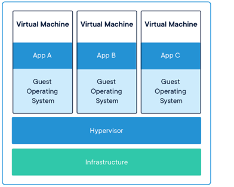
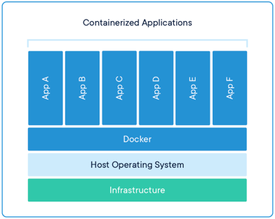

# Pengenalan Docker Container
## Kasus Deployment Aplikasi
### Deployment VM

- Dalam Deployment Aplikasi biasanya kita perlu menyiapkan distribusi aplikasinya(yang sudah di build, misal di Java ada .jar, di Golang ada Biner File .exe)
- Lalu menyiapkan di sisi server Production yaitu install OS di server, library, runtime mesin(JVM di Java), database, webserver(apache tomcat misal).

### Deployment Docker

- Pertama docker akan membundle aplikasi berserta dependency yang dibutuhkan(database, runtime mesin, web server, libraries)
- Deploy ke Server Production yang sudah ada OSnya, tidak install dependencies lagi.

## Container != VM
- Berbeda dengan VM, Container sendiri berfokus pada sisi Aplikasi
- Container sendiri sebenarnya berjalan diatas aplikasi Container Manager yang berjalan di sistem operasi.
- Yang membedakan dengan VM adalah, pada Container, kita bisa mem-package aplikasi dan dependency-nya tanpa harus menggabungkan sistem operasi
- Container akan menggunakan sistem operasi host dimana Container Manager nya berjalan, oleh karena itu,
- Container akan lebih hemat resource dan lebih cepat jalan nya, karena tidak butuh sistem operasi sendiri
- Ukuran Container biasanya hanya hitungan MB, berbeda dengan VM yang bisa sampai GB karena di dalamnya ada sistem operasinya
