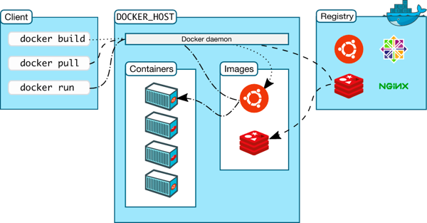

# Architecture Docker

- Docker menggunakan arsitektur Client-Server
- Docker client berkomunikasi dengan Docker daemon (server)
- Saat kita menginstall Docker, biasanya didalamnya sudah terdapat Docker Client dan Docker Daemon
- Docker Client dan Docker Daemon bisa berjalan di satu sistem yang sama
- Docker Client dan Docker Daemon berkomunikasi menggunakan REST API