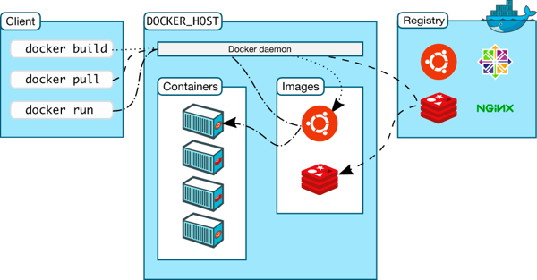

# Container Registry

- Docker Registry adalah tempat kita menyimpan Docker Image
- Dengan menggunakan Docker Registry, kita bisa menyimpan Image yang kita buat, dan bisa digunakan di Docker Daemon dimanapun selama bisa terkoneksi ke Docker Registry
- Bisa juga upload ke Registry untuk di gunakan orang lain
- Contoh Registry
    + Docker Hub : https://hub.docker.com/ 
    + Digital Ocean Container Registry : https://www.digitalocean.com/products/container-registry/ 
    + Google Cloud Container Registry : https://cloud.google.com/container-registry 
    + Amazon Elastic Container Registry : https://aws.amazon.com/id/ecr/ 
    + Azure Container Registry : https://azure.microsoft.com/en-us/services/container-registry/ 

